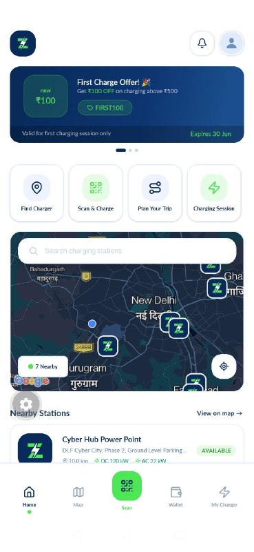
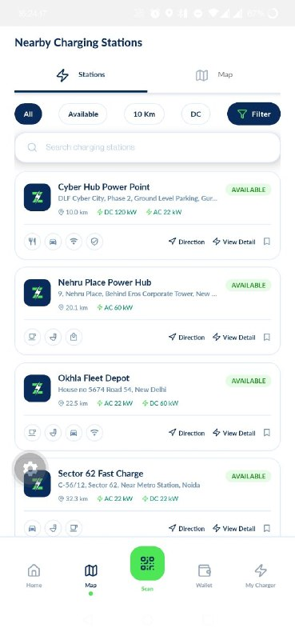
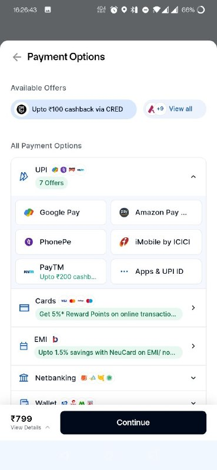
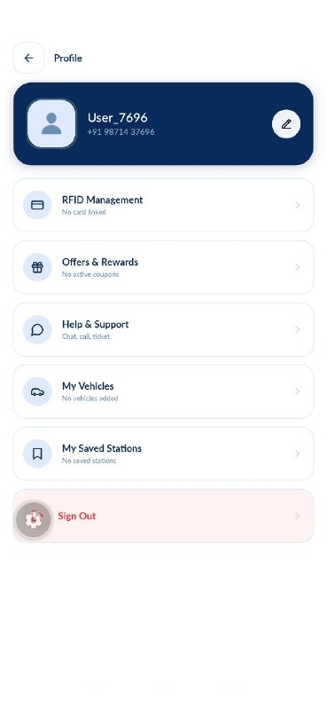
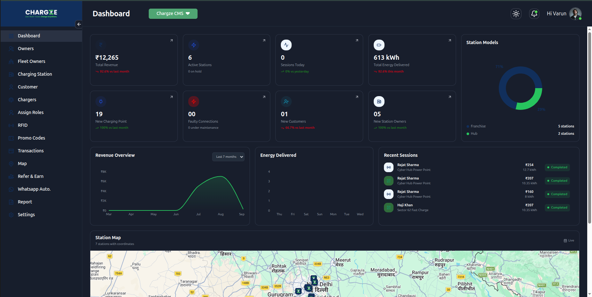

# Chargze — EV Marketplace & Charging Platform

<p align="center">
  
</p>

<p align="center">
  <strong>EV Marketplace & Charging Platform</strong>
</p>

<p align="center">
  React Native · TypeScript · GraphQL · Node.js · PostgreSQL · Razorpay
</p>

<p align="center">
  <a href="./releases/latest">
    
  </a>
  &nbsp;
  <a href="https://admin.chargze.com/">
    
  </a>
</p>


## Overview

Chargze is an EV-focused platform consisting of a cross-platform mobile application,
web-based admin dashboard, and backend services.

The platform provides users with an interface for discovering EV products,
viewing product information, managing their account, and completing
payment-related workflows.

The administrative dashboard provides an interface for managing platform
data and operations.

### Platform Components

- Cross-platform mobile application
- Web-based admin dashboard
- GraphQL backend services
- PostgreSQL database
- Razorpay payment integration
- Google Maps and navigation

---

# Mobile Application

The Chargze mobile application is built using React Native and TypeScript.

### Key Areas

- User authentication
- EV product discovery
- Product browsing
- Product details
- User profile
- Payment integration
- Google Maps and navigation
- API-driven application architecture

<p align="center">
  
  &nbsp;&nbsp;
  
  &nbsp;&nbsp;
  
  &nbsp;&nbsp;
  
</p>

---

# Admin Dashboard

Chargze also includes a web-based administration dashboard for managing
platform data and operations.

<p align="center">
  
</p>

<p align="center">
  <a href="https://admin.chargze.com/">
    <strong>Open Live Admin Dashboard</strong>
  </a>
</p>

> Access to the dashboard may require authentication.

---

# System Architecture

The Chargze platform is composed of a mobile application, administrative
dashboard, GraphQL API layer, backend services, database, caching layer,
and payment integration.

<p align="center">
  
</p>

### Request Flow


```text
                         Chargze PLATFORM
                                │
               ┌────────────────┴────────────────┐
               │                                 │
        Mobile Application                 Admin Dashboard
          React Native                         Web App
          TypeScript
               │                                 │
               └────────────────┬────────────────┘
                                │
                           GraphQL API
                                │
                         Node.js Backend
                                │
              ┌─────────────────┼─────────────────┐
              │                 │                 │
          PostgreSQL          Redis            Razorpay
           Database           Cache             Payments


    
## Request Flow

User
 │
 ▼
React Native Application
 │
 │ GraphQL Request
 ▼
Node.js Backend
 │
 ├── Authentication
 ├── Business Logic
 ├── GraphQL Resolvers
 │
 ├──────────────► PostgreSQL
 │
 ├──────────────► Redis
 │
 └──────────────► Razorpay


## Technical Implementation

| Layer             | Technology            |
| ----------------- | --------------------- |
| Mobile            | React Native          |
| Language          | TypeScript            |
| API               | GraphQL               |
| Backend           | Node.js               |
| Database          | PostgreSQL            |
| Cache             | Redis                 |
| Payments          | Razorpay              |
| Maps & Navigation | Google Maps Platform  |
| Cloud             | Google Cloud Platform |
| Admin             | Web Dashboard         |
| Version Control   | Git / GitHub          |


# Engineering Highlights

GraphQL API

The mobile application communicates with backend services through GraphQL,
allowing individual screens to request the data required by their respective
workflows.

Authentication

The application implements authenticated communication between the mobile
client and backend services.

Payment Integration

Razorpay is integrated to support payment-related workflows within the
platform.

Maps & Navigation

Google Maps Platform is used to provide map-based functionality and
navigation within the application.

Admin Operations

The web dashboard provides an interface for managing platform data and
administrative operations.


## Download

Try the Chargze Android application.

<p align="center">
  <a href="../../releases/latest">
    
  </a>
</p>

<p align="center">
  <strong>Latest Release: v1.0.0</strong>
</p>

<p align="center">
  <a href="../../releases/latest">
    View Release & Download APK →
  </a>
</p>

> The APK is provided for demonstration and portfolio purposes.


# Project Links

| Resource               | Link                                                                 |
| ---------------------- | -------------------------------------------------------------------- |
| Android APK         | [Download Latest Release](./releases/latest)                         |
| Admin Dashboard    | [Open Dashboard](https://admin.chargze.com/)                         |
| Showcase Repository | [GitHub](https://github.com/ashutosh-rootandleaves/Chargze-Showcase) |
| Source Code         | Private                                                              |


About This Repository

This repository is a project showcase for the Chargze platform.

It contains:

Project documentation
Application screenshots
System architecture
Technology overview
Android showcase builds

The proprietary source code of the Chargze platform is maintained in a
private repository.


# Disclaimer

The screenshots, application builds, branding, and architecture information
are provided for demonstration and portfolio purposes.