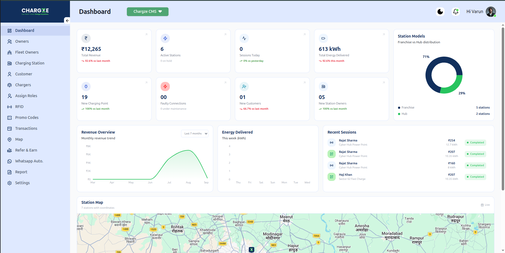

# Chargez — EV Marketplace & Charging Platform

<p align="center">
  
</p>

<p align="center">
  <strong>EV Marketplace & Charging Platform</strong>
</p>

<p align="center">
  React Native · TypeScript · GraphQL · Node.js · PostgreSQL · Razorpay
</p>

<p align="center">

  [Download APK](#download)

  ·

  [Live Admin Dashboard](https://admin.chargze.com/)

</p>

---

## Overview

Chargez is an EV-focused platform consisting of a cross-platform mobile application,
web-based admin dashboard, and backend services.

The platform is designed to provide users with an interface for discovering EV
products and managing their account, while administrators can manage platform
data through the web dashboard.

### Platform Components

- Cross-platform mobile application
- Web-based admin dashboard
- GraphQL backend services
- PostgreSQL database
- Razorpay payment integration

---

# Mobile Application

The Chargez mobile application is built using React Native and TypeScript.

### Key Areas

- User authentication
- EV product discovery
- Product browsing
- Product details
- User profile
- Payment integration
- API-driven application architecture

<p align="center">
  
  
  
  
</p>

---

# Admin Dashboard

Chargez also includes a web-based administration dashboard for managing
platform data and operations.

<p align="center">
  
</p>

🔗 **Live Admin Dashboard:**  
https://admin.chargze.com/

> Access to the dashboard may require authentication.

---

# System Architecture

```text
                         CHARGEZ PLATFORM
                                │
               ┌────────────────┴────────────────┐
               │                                 │
        Mobile Application                 Admin Dashboard
          React Native                         Web App
          TypeScript
               │                                 │
               └────────────────┬────────────────┘
                                │
                           GraphQL API
                                │
                         Node.js Backend
                                │
              ┌─────────────────┼─────────────────┐
              │                 │                 │
          PostgreSQL          Redis            Razorpay
           Database           Cache             Payments


    
## Request Flow

User
 │
 ▼
React Native Application
 │
 │ GraphQL Request
 ▼
Node.js Backend
 │
 ├── Authentication
 ├── Business Logic
 ├── GraphQL Resolvers
 │
 ├──────────────► PostgreSQL
 │
 ├──────────────► Redis
 │
 └──────────────► Razorpay


## Technical Implementation

| Layer           | Technology    |
| --------------- | ------------- |
| Mobile          | React Native  |
| Language        | TypeScript    |
| API             | GraphQL       |
| Backend         | Node.js       |
| Database        | PostgreSQL    |
| Cache           | Redis         |
| Payments        | Razorpay      |
| Admin           | Web Dashboard |
| Version Control | Git / GitHub  |


# Engineering Highlights

GraphQL API

The mobile application communicates with the backend through GraphQL APIs,
allowing the client to request the data required by individual screens.

Authentication

The application implements authenticated API communication between the
mobile client and backend services.

Payment Integration

Razorpay is integrated to handle payment-related workflows within the
platform.

Admin Operations

The web dashboard provides an interface for managing platform data and
administrative operations.


# Download

Android APK

You can download the latest Android build from GitHub Releases.

Latest Release

Chargez-v1.0.0.apk

Download Latest APK

Installation
Download the APK on an Android device.
Open the downloaded APK.
Allow installation from the requested source if Android prompts you.
Install the application.

This APK is provided for demonstration purposes.


# Project Links

| Resource         | Link                                                     |
| ---------------- | -------------------------------------------------------- |
| Admin Dashboard  | [https://admin.chargze.com/](https://admin.chargze.com/) |
| Android APK      | GitHub Releases                                          |
| Project Showcase | GitHub                                                   |
| Source Code      | Private                                                  |


# Disclaimer

This repository is a project showcase and does not contain the proprietary
source code of the Chargez platform.

The screenshots, application builds, branding, and architecture information
are provided for demonstration and portfolio purposes.